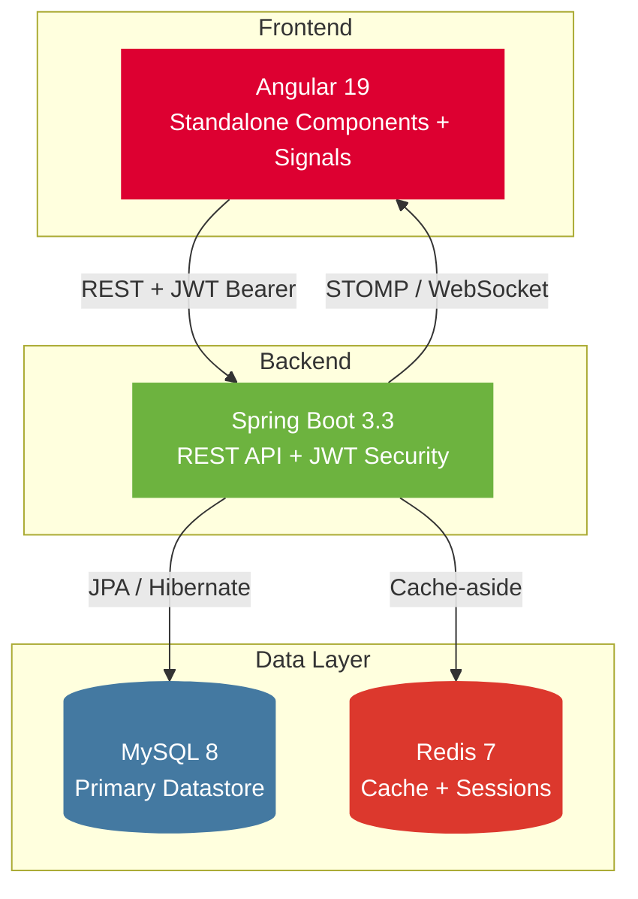

<div align="center">

# FacilityFlow

**Enterprise Facility & Asset Management Platform**

[](https://openjdk.org/)
[](https://spring.io/projects/spring-boot)
[](https://angular.dev/)
[](https://www.mysql.com/)
[](https://redis.io/)
[](https://jwt.io/)
[](https://www.docker.com/)
[](https://developer.mozilla.org/en-US/docs/Web/API/WebSockets_API)
[](https://swagger.io/)
[](https://mapstruct.org/)

*A full-stack platform for managing buildings, rooms, assets, maintenance tickets, and reservations across an organization.*

</div>

---

## Overview

FacilityFlow is a production-style enterprise application for managing an organization's physical footprint — buildings, floors, rooms, equipment, and the day-to-day operations that keep them running. It brings facility management, IT asset tracking, and maintenance workflows into a single system instead of the spreadsheets and email threads most teams default to.

It's built for the people who actually run a workplace: facility managers coordinating room bookings and vendor maintenance, IT/ops teams tracking hundreds of computers, chairs, and printers across floors, and employees who just want to book a meeting room or report a broken AC without filing a support ticket by hand. Each of these roles gets a purpose-built view, backed by one consistent source of truth.

The project was built as a demonstration of production-grade, full-stack engineering practices — layered backend architecture, JWT-secured REST APIs, real-time notifications, Redis caching, and a component-driven Angular frontend — applied to a problem domain complex enough to actually exercise them: concurrent room bookings that must never double-book, SLA-driven ticket escalation, and QR-tracked physical assets.

---

## Architecture



Both services are independently deployable and communicate exclusively over a versioned REST API, with a WebSocket channel layered on top for real-time notifications (ticket updates, reservation approvals).

---

## Key Features

| | |
|---|---|
| 🔐 **JWT Authentication** | Access + rotating refresh tokens, role-based authorization |
| 🏢 **Facility Management** | Buildings → Floors → Rooms hierarchy with capacity & status |
| 📅 **Room Reservations** | Approval workflow with **double-booking prevention** |
| 🛠️ **Maintenance Tickets** | Priority-based SLA escalation, technician assignment, threaded comments |
| 💻 **Asset Management** | Computers, furniture, AV equipment — with **QR code tracking** |
| 🔔 **Notifications** | Real-time via WebSocket + async email |
| ⚡ **Redis Caching** | Dashboard stats and frequently accessed rooms |
| 📜 **Audit Logs** | Immutable trail of every login, mutation, and role change |
| 📊 **Dashboard** | Live operational metrics across users, tickets, assets, reservations |
| 🐳 **Dockerized** | One-command spin-up via Docker Compose |
| 📖 **Swagger / OpenAPI** | Fully documented, interactive API reference |

---

## Technology Stack

| Layer | Technologies |
|---|---|
| **Frontend** | Angular 19 (standalone + signals), Reactive Forms, SCSS design tokens |
| **Backend** | Java 21, Spring Boot 3.3, Spring Security, Spring Data JPA, MapStruct |
| **Database** | MySQL 8, Flyway migrations |
| **Caching** | Redis 7 |
| **Security** | JWT (access + refresh), BCrypt, method-level `@PreAuthorize` |
| **DevOps** | Docker, Docker Compose, Maven |

---

## Repository Structure

```
FacilityFlow/
├── README.md              ← you are here
├── backend/                Spring Boot API — see backend/README.md
├── frontend/                Angular application — see frontend/README.md
├── docs/                    Architecture notes, diagrams
└── screenshots/             Application screenshots
```

---

## Documentation

Each service maintains its own detailed documentation, including full setup instructions, environment configuration, and design notes:

- 📘 **[Backend README](./backend/README.md)** — architecture, ER diagram, API reference, Docker setup, seeded accounts
- 📗 **[Frontend README](./frontend/README.md)** — project structure, design system, state management, build instructions

Start there for anything beyond a quick overview.

---

## Getting Started

```bash
git clone https://github.com/Ankitashipra/FacilityFlow
cd facilityflow

# Backend — see backend/README.md for full instructions
cd facilityflow-backend

# Frontend — see frontend/README.md for full instructions
cd ../facilityFlow-frontend
```

Full setup (Docker Compose, environment variables, seeded demo accounts) is documented in each service's own README, linked above.

---

## Project Highlights

- **Layered backend architecture** — controller → service → repository → entity, with DTOs at every boundary and entities never exposed over the API
- **JWT authentication** with rotating, database-backed refresh tokens
- **Redis-backed caching** for expensive dashboard aggregations and frequent room lookups
- **Real-time updates** over WebSocket (STOMP) for tickets and reservations
- **Fully Dockerized** — MySQL, Redis, and the backend spin up together with one command
- **Scalable, modular design** intended to mirror how this would actually be built inside a company, not a tutorial-scale CRUD app

---

## Future Enhancements

- 📈 Advanced analytics dashboard with historical trends
- 📱 Native mobile application
- 🏬 Multi-tenant support for managing multiple organizations
- 🔑 SSO / SAML integration
- ☸️ Kubernetes deployment manifests

--

