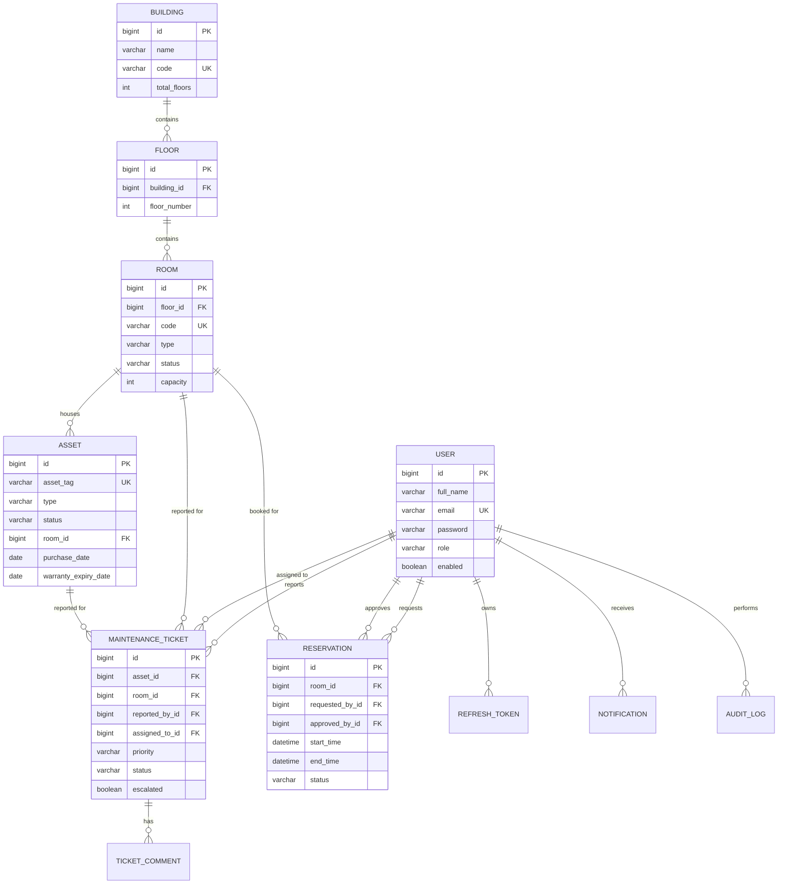
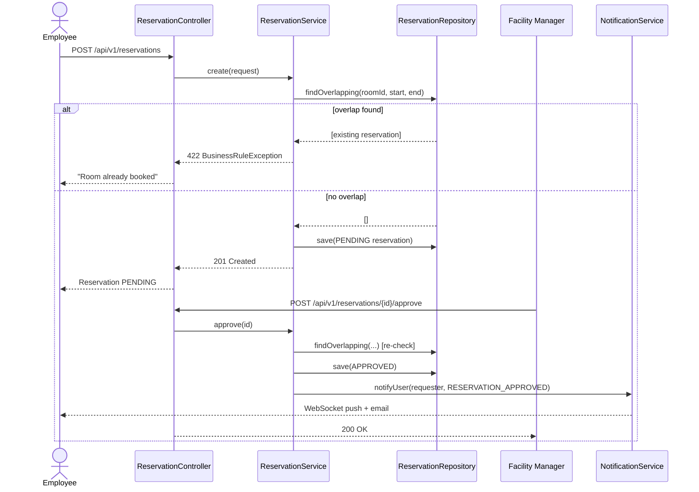

# FacilityFlow

Enterprise Facility & Asset Management Platform — a production-style Spring Boot backend for managing buildings, rooms, assets, maintenance tickets, and meeting-room reservations across an organization.

Built with **Java 21 · Spring Boot 3.3 · Spring Security (JWT) · Spring Data JPA · MySQL 8 · Redis · Flyway · MapStruct · Docker**.

---

## 1. Features

| Module | Capabilities |
|---|---|
| **Authentication** | Register, login, JWT access + rotating refresh tokens, logout, role-based authorization (`ADMIN`, `FACILITY_MANAGER`, `EMPLOYEE`), BCrypt password hashing |
| **User Management** | CRUD, profile, change password, soft delete, pagination, search, filter by role |
| **Facility Management** | Buildings → Floors → Rooms hierarchy, capacity, status, search |
| **Asset Management** | Computers, chairs, ACs, projectors, printers — with auto-generated QR codes, purchase date, warranty tracking, room assignment |
| **Maintenance** | Ticket creation, technician assignment, status workflow, priority, threaded comments, incident reports |
| **Reservations** | Book meeting rooms, approve/reject workflow, **double-booking prevention**, calendar view, auto-expiry |
| **Notifications** | In-app + real-time WebSocket (STOMP) push + best-effort email, on ticket/reservation events |
| **Audit Logs** | Immutable trail of logins, CRUD, role changes, approvals/rejections |
| **Dashboard** | Total/active users, open/closed tickets, asset counts, active reservations, top buildings by usage — Redis-cached |
| **Scheduling** | Automatic ticket escalation (SLA breach by priority), expired reservation cleanup, daily email report, refresh-token purge |
| **Caching** | Redis-backed dashboard stats and frequently accessed rooms |
| **API Docs** | Full OpenAPI 3 / Swagger UI |

---

## 2. Architecture

Layered architecture with a strict dependency direction: `controller → service → repository → entity`. DTOs are used at every boundary — **entities are never exposed** over the API.

```
com.facilityflow
├── controller/     REST endpoints (thin — validation + delegation only)
├── service/        Interfaces
│   └── impl/       Business logic, transactions, orchestration
├── repository/     Spring Data JPA repositories (+ Specifications where needed)
├── entity/         JPA entities, enums
├── dto/
│   ├── request/     Inbound payloads (Bean Validation annotated)
│   └── response/    Outbound payloads
├── mapper/         MapStruct entity <-> DTO mappers
├── config/         Security, CORS, Redis/Cache, Swagger, WebSocket, Async, JPA auditing
├── security/       JWT service, filter, UserDetails, principal
├── exception/      Custom exceptions + global @RestControllerAdvice handler
├── util/           QR code generation, pagination helpers
├── scheduler/       @Scheduled jobs (escalation, cleanup, reports)
└── audit/          Async audit-trail writer
```

**Why this shape:**
- **DTOs everywhere** — entities carry JPA proxies, lazy collections, and bidirectional references that don't serialize safely; DTOs are explicit, versioned contracts.
- **Constructor injection only** (`@RequiredArgsConstructor`, `final` fields) — no field injection, so every dependency is visible and testable.
- **Soft deletes** via a `BaseEntity` with `is_deleted` + `@SQLRestriction`, so historical references (e.g. a closed ticket pointing at a decommissioned room) stay intact.
- **Optimistic locking** (`@Version`) on every entity to catch concurrent-edit conflicts under load.

---

## 3. Entity-Relationship Diagram



---

## 4. Sequence Diagram — Room Reservation (with double-booking prevention)



---

## 5. Getting Started

### Option A — Docker Compose (recommended)

```bash
docker compose up --build
```

This starts MySQL, Redis, and the backend together. Flyway runs the schema + seed migrations automatically on boot. API available at `http://localhost:8080`, Swagger UI at `http://localhost:8080/swagger-ui.html`.

### Option B — Local development

1. Start MySQL and Redis (or use `docker compose up mysql redis` for just the infra).
2. Create the database: `CREATE DATABASE facilityflow;`
3. Set environment variables (or edit `application.yml` directly):
   ```
   DB_USERNAME=root
   DB_PASSWORD=root
   ```
4. Run:
   ```bash
   mvn spring-boot:run
   ```
5. Flyway applies `V1__init_schema.sql` and `V2__seed_data.sql` on startup.

### Seeded accounts (password for all: `Password123`)

| Email | Role |
|---|---|
| admin@facilityflow.com | ADMIN |
| manager@facilityflow.com | FACILITY_MANAGER |
| technician@facilityflow.com | EMPLOYEE (maintenance technician) |
| employee@facilityflow.com | EMPLOYEE |

### Running tests

```bash
mvn test
```

---

## 6. API Documentation

Once running: **Swagger UI** → `http://localhost:8080/swagger-ui.html`
Raw OpenAPI spec → `http://localhost:8080/v3/api-docs`

A ready-to-import Postman collection is included at [`postman/FacilityFlow.postman_collection.json`](postman/FacilityFlow.postman_collection.json) — it covers auth, users, facilities, rooms, assets, tickets, reservations, notifications, dashboard, and audit logs, with a pre-request script that auto-captures the access token after login.

---

## 7. Configuration

All configuration lives in `application.yml`, overridable via environment variables:

| Variable | Purpose | Default |
|---|---|---|
| `DB_HOST`, `DB_PORT`, `DB_NAME`, `DB_USERNAME`, `DB_PASSWORD` | MySQL connection | `localhost:3306/facilityflow` |
| `REDIS_HOST`, `REDIS_PORT` | Redis connection | `localhost:6379` |
| `JWT_SECRET` | HMAC signing key for access tokens | dev key (change in production) |
| `JWT_ACCESS_EXPIRATION` | Access token TTL (ms) | `900000` (15 min) |
| `JWT_REFRESH_EXPIRATION` | Refresh token TTL (ms) | `604800000` (7 days) |
| `CORS_ORIGINS` | Allowed frontend origin(s) | `http://localhost:4200` |
| `MAIL_HOST`, `MAIL_PORT`, `MAIL_USERNAME`, `MAIL_PASSWORD` | SMTP for email notifications | — |

---

## 8. Security Model

- Stateless JWT access tokens (15 min TTL) signed with HMAC-SHA256.
- Opaque, database-backed refresh tokens (7 day TTL) that rotate on every use and can be revoked server-side.
- `@PreAuthorize` method security on every mutating/privileged endpoint, layered on top of the URL-level filter chain.
- Passwords hashed with BCrypt (strength 12).
- Every mutating action writes an async audit-log entry with actor, IP, and timestamp.

---

## 9. Design Decisions Worth Knowing

- **Escalation SLA is priority-driven**, not a single fixed timeout — configured per-priority in `application.yml` under `app.ticket.escalation-hours`.
- **Reservation overlap is checked twice**: once at request time, once again at approval time, since two overlapping requests can both be left `PENDING` before either is decided.
- **Dashboard stats are cached for 2 minutes** in Redis — expensive aggregate queries, hit on every page load, don't need to be real-time to the second.
- **Room lookups are cached for 15 minutes** and evicted on any room mutation.
